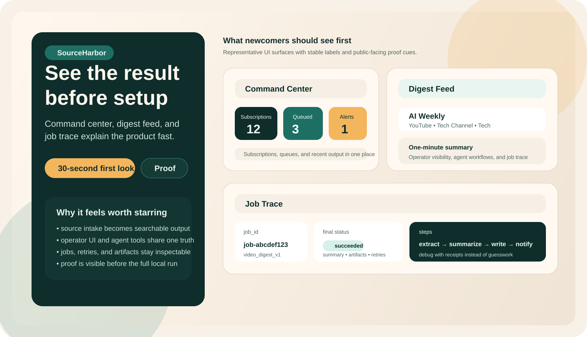

# SourceHarbor

<p align="center">
  
</p>

<p align="center">
  <strong>Turn YouTube, Bilibili, and RSS sources into readable digests, traceable job runs, and searchable knowledge for operators and agents.</strong>
</p>

<p align="center">
  <a href="#see-it-in-30-seconds">See It In 30 Seconds</a>
  ·
  <a href="./docs/start-here.md">Run Locally</a>
  ·
  <a href="./docs/see-it-fast.md">No-Boot Tour</a>
  ·
  <a href="./docs/index.md">Docs Home</a>
  ·
  <a href="./docs/proof.md">Proof</a>
  ·
  <a href="./docs/compare.md">Why It Stands Out</a>
  ·
  <a href="https://github.com/xiaojiou176-open/sourceharbor/discussions">Discussions</a>
</p>

<p align="center">
  
  
  
  
</p>

SourceHarbor is a GitHub-native knowledge pipeline for teams who need more than a transcript dump.

It helps you subscribe to long-form sources, pull fresh items, turn them into digests, inspect every step, ship artifacts, and reuse the same knowledge surface through API, MCP, and a browser command center.

There are two honest first paths:

- **Evaluate fast:** inspect the product shape and evidence surfaces without booting anything.
- **Run locally:** install dependencies, boot the stack, and queue a real job on your own machine.

> Truth route, in plain English:
> `README.md` is the front door, [`docs/start-here.md`](./docs/start-here.md) is the first real run, [`docs/proof.md`](./docs/proof.md) is the proof ladder, `docs/generated/*` pages are render-only pointers, and `.agents/Plans/*` files are historical execution archives rather than current public truth.

## See It In 30 Seconds

If you only have half a minute, do not start with setup. Start with the three surfaces that explain the product fastest:

1. **Command center:** one operator view for subscriptions, intake, job counts, and recent artifacts.
2. **Digest feed:** a reading flow where entries such as `AI Weekly` and `Digest One` become reusable summaries instead of lost links.
3. **Job trace:** a step-by-step timeline with statuses, retries, degradations, and artifact references.

```text
Source -> queued job -> digest feed -> searchable artifact -> MCP / API reuse
```

Representative result shape, based on the current digest template and UI surfaces:

```markdown
# AI Weekly

> Source: [Original video](https://www.youtube.com/watch?v=abc)
> Platform: youtube | Video ID: video-uid-123 | Generated at: 2026-02-10T00:00:00Z

## One-Minute Summary
- This episode focuses on agent workflows, operator visibility, and job trace.

## Key Takeaways
- Every job carries a step summary, artifacts index, and pipeline final status.
```

For the lightweight evaluation path, go to [docs/see-it-fast.md](./docs/see-it-fast.md).

## Why Star SourceHarbor Now

- **It solves the full loop, not a single step.** SourceHarbor handles subscription intake, ingestion, digest production, artifact indexing, notifications, and retrieval in one system.
- **It exposes proof, not vague claims.** Jobs, artifacts, step summaries, CI, and local verification paths are all first-class public surfaces.
- **It is ready for operators and agents at the same time.** Humans use the command center. Agents use API and MCP. Both point at the same pipeline.
- **It is already shaped like a real product.** The repository is source-first and inspectable, but the public surface is now optimized around outcomes rather than internal wiring.

## What You Get

| Surface | What you can do | Why it matters |
| :-- | :-- | :-- |
| **Subscriptions** | Track YouTube, Bilibili, and RSS sources | Build a durable intake layer instead of pasting one-off URLs |
| **Digest feed** | Read generated summaries in a single operator flow | Turn long-form content into an actionable daily reading stream |
| **Job trace** | Inspect pipeline status, retries, degradations, and artifacts | Debug with evidence instead of guessing what happened |
| **Notifications** | Send video digests and daily digests to email | Push results outward instead of trapping them in a database |
| **Retrieval** | Search over generated artifacts | Reuse digests as a searchable knowledge layer |
| **MCP tools** | Expose ingestion, jobs, artifacts, search, and notifications to agents | Let assistants act on the same system without custom glue code |

## Evaluate Fast: No-Boot Tour

Think of this like walking past a storefront window before deciding whether to step inside.

This path is for evaluation, not a hosted trial. You are inspecting the product shape, evidence surfaces, and result format before deciding whether a local run is worth it.

1. Open [docs/see-it-fast.md](./docs/see-it-fast.md) to see the command center, digest feed, and job trace path in one page.
2. Open [docs/proof.md](./docs/proof.md) to see what is locally provable today and where the public-proof boundary stops. Treat it as the evidence map, not as a machine-generated live verdict page.
3. If the shape matches what you need, continue to [docs/start-here.md](./docs/start-here.md) for the local boot path.

## Run Locally: Result Path

This is the shortest truthful local setup path. It starts when you are ready to install dependencies and boot the stack yourself; it is not a hosted "try now" flow.

By the end of this path, you should have:

- a local stack running
- a first queued or completed processing job
- a digest feed you can inspect
- a job page with step-level evidence

### 1. Boot the stack

```bash
cp .env.example .env
UV_PROJECT_ENVIRONMENT="${UV_PROJECT_ENVIRONMENT:-$HOME/.cache/sourceharbor/project-venv}" \
  uv sync --frozen --extra dev --extra e2e
npm --prefix apps/web ci
./bin/bootstrap-full-stack
./bin/full-stack up
```

Open the operator UI:

- `http://127.0.0.1:3000`

### 2. Set the local write token for direct API calls

```bash
export SOURCE_HARBOR_API_KEY="${SOURCE_HARBOR_API_KEY:-sourceharbor-local-dev-token}"
```

### 3. Queue a first processing run

Replace the sample URL with any public YouTube or Bilibili video:

```bash
curl -sS -X POST http://127.0.0.1:9000/api/v1/videos/process \
  -H "Content-Type: application/json" \
  -H "X-API-Key: ${SOURCE_HARBOR_API_KEY}" \
  -d '{
    "video": {
      "platform": "youtube",
      "url": "https://www.youtube.com/watch?v=dQw4w9WgXcQ"
    },
    "mode": "full"
  }'
```

### 4. Inspect the resulting job and feed

```bash
curl -sS http://127.0.0.1:9000/api/v1/videos | jq
curl -sS http://127.0.0.1:9000/api/v1/feed/digests | jq
curl -sS http://127.0.0.1:9000/api/v1/jobs/<job-id> | jq
```

### 5. Run the repo smoke path

```bash
./bin/smoke-full-stack --offline-fallback 0
```

When you want the operator-side log trail, start at `.runtime-cache/logs/components/full-stack`.

For a guided version with operator notes and public-proof boundaries, go to [docs/start-here.md](./docs/start-here.md).

## Why SourceHarbor Feels Different

Most repos in this space stop at one of these layers:

- a transcript extractor
- a summarizer script
- a search index
- an internal dashboard

SourceHarbor is built around the full knowledge flow:

1. **Capture** sources continuously
2. **Process** each item into job-backed artifacts
3. **Read** results in a digest feed
4. **Search** generated knowledge later
5. **Deliver** updates through notifications
6. **Reuse** the same surface through MCP and API

See the full comparison in [docs/compare.md](./docs/compare.md).

## Public Proof, Not Hand-Waving

This repository does not ask you to trust product copy on its own.

- **Proof of behavior:** [docs/start-here.md](./docs/start-here.md)
- **Proof of architecture:** [docs/architecture.md](./docs/architecture.md)
- **Proof of verification:** [docs/testing.md](./docs/testing.md)
- **Proof of current public claims:** [docs/proof.md](./docs/proof.md)

GitHub profile description, homepage, topics, discussions, and social preview intent are tracked in `config/public/github-profile.json`, but the live GitHub settings still require GitHub-side verification.

Generated docs under `docs/generated/` can point you toward runtime-owned evidence, but they are not the current verdict themselves. Historical plans under `.agents/Plans/` explain past execution context only and should not be read as the current public truth route.

> SourceHarbor is a public, source-first engineering repository.
>
> It is inspectable, and you can run it locally. It is not marketed as a turnkey hosted product, and external distribution claims are valid only when live remote workflows prove them for the current `main` commit.

## Documentation Map

Start where you are:

- **I want the fastest first impression:** [docs/index.md](./docs/index.md)
- **I want the no-boot product tour:** [docs/see-it-fast.md](./docs/see-it-fast.md)
- **I want to see a real local result:** [docs/start-here.md](./docs/start-here.md)
- **I want the system map:** [docs/architecture.md](./docs/architecture.md)
- **I want proof and verification commands:** [docs/proof.md](./docs/proof.md)
- **I want testing and CI details:** [docs/testing.md](./docs/testing.md)
- **I want positioning and trade-offs:** [docs/compare.md](./docs/compare.md)
- **I want contributor/community paths:** [CONTRIBUTING.md](./CONTRIBUTING.md), [SUPPORT.md](./SUPPORT.md), [SECURITY.md](./SECURITY.md)

## FAQ Snapshot

### Is this a hosted SaaS?

No. SourceHarbor is a source-first repository you can inspect, run locally, adapt, and extend.

### Is this only for video?

No. The public surface is strongest around long-form video today, but the feed and retrieval layers already model both `video` and `article` content types.

### Why star it if I am not deploying it this week?

Because it sits at the intersection of source ingestion, digest pipelines, retrieval, operator UI, and MCP reuse. Even if you are not adopting it immediately, it is a strong reference point for how to turn long-form inputs into reusable knowledge products.

More questions are answered in [docs/faq.md](./docs/faq.md).

## Repository Surfaces

- `apps/api`: FastAPI service for ingestion, jobs, artifacts, retrieval, notifications, and operator controls
- `apps/worker`: pipeline runner, Temporal workflows, and delivery automation
- `apps/mcp`: MCP tool surface for agents
- `apps/web`: browser command center for operators
- `contracts`: shared schemas and generated contract artifacts
- `docs`: layered public navigation, proof, and architecture

## Community

- **Questions and roadmap discussion:** [GitHub Discussions](https://github.com/xiaojiou176-open/sourceharbor/discussions)
- **Bug reports and feature requests:** [GitHub Issues](https://github.com/xiaojiou176-open/sourceharbor/issues)
- **Security reports:** [SECURITY.md](./SECURITY.md)
- **Project conduct and ownership:** [CODE_OF_CONDUCT.md](./CODE_OF_CONDUCT.md), [.github/CODEOWNERS](./.github/CODEOWNERS)
- **Rights and public artifact boundaries:** [THIRD_PARTY_NOTICES.md](./THIRD_PARTY_NOTICES.md), [docs/reference/public-artifact-exposure.md](./docs/reference/public-artifact-exposure.md)
- **Public asset provenance:** [docs/reference/public-assets-provenance.md](./docs/reference/public-assets-provenance.md)

## License

SourceHarbor is released under the MIT License. See [LICENSE](./LICENSE).
