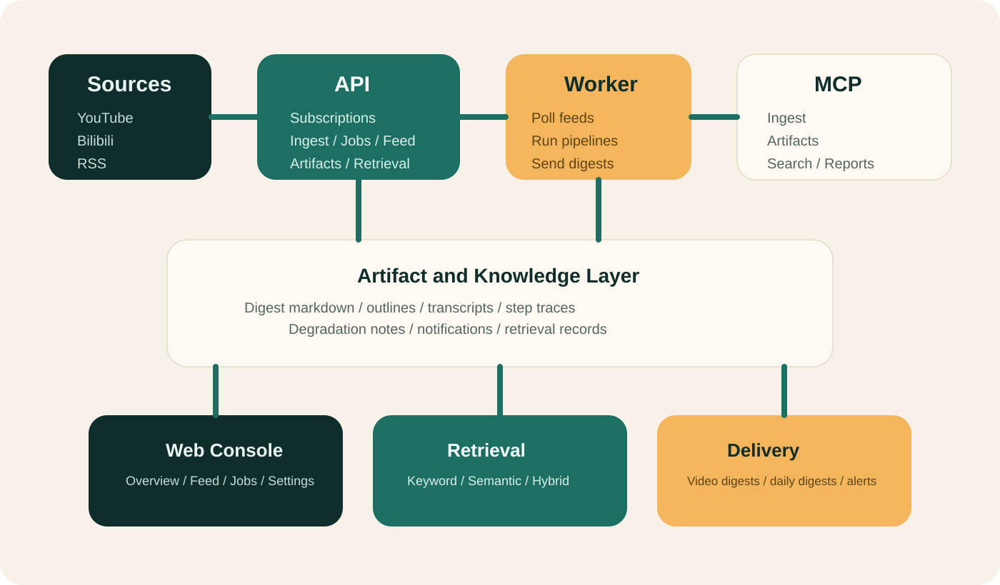

# Architecture

SourceHarbor is easiest to understand as a single knowledge pipeline with four outward-facing surfaces.

  

## The Product Model

Long-form sources come in.

Artifacts, digests, and traceable jobs come out.

Everything else in the repository exists to make that loop reliable, inspectable, and reusable.

## The Four Runtime Surfaces

### API

`apps/api` exposes HTTP endpoints for:

- subscriptions
- ingestion
- videos and jobs
- digest feed
- artifacts
- retrieval
- notifications
- operator-facing controls

### Worker

`apps/worker` runs the asynchronous pipeline:

- poll feeds
- queue and process jobs
- write artifacts
- send video digests
- send daily digests
- retry delivery failures

### MCP

`apps/mcp` exposes the same system as agent tools:

- ingest
- subscriptions
- jobs
- artifacts
- retrieval
- notifications
- reports
- UI audit hooks

### Web

`apps/web` is the operator command center:

- command overview
- proof boundary
- ops inbox / diagnostics
- watchlists and trends
- search and Ask front door
- digest reading flow
- ingest run ledger
- knowledge layer
- subscription management
- job trace
- notification settings
- sample playground
- use-case landing pages

## Shared Surfaces

- `contracts`: shared schemas and contract artifacts
- `infra`: compose, migrations, runtime infrastructure, and deployment assets
- `scripts` and `bin`: reproducible operator and CI entrypoints, including the runtime route snapshot under `.runtime-cache/run/full-stack/resolved.env`

## Under Evaluation, Not Runtime Surfaces

Two directions are intentionally kept outside the current runtime surface:

- **Agent Autopilot**: SourceHarbor has workflows, MCP, retrieval, notifications, and evidence surfaces that can support a future spike, but it does not currently expose autonomous research ops as a product claim.
- **Hosted workspace**: SourceHarbor already has product-shaped front doors, but the repository still assumes source-first, local-proof-first operation rather than a managed multi-tenant service.

See:

- [2026-03-31-agent-autopilot-spike.md](./blueprints/2026-03-31-agent-autopilot-spike.md)
- [2026-03-31-hosted-readiness-spike.md](./blueprints/2026-03-31-hosted-readiness-spike.md)

## Design Principles

- **Result-first operations:** a newcomer should be able to produce a real job before reading deep internals
- **One truth, many surfaces:** API, MCP, and web all point at the same pipeline state
- **Proof over promises:** jobs, artifacts, smoke scripts, and CI back up public claims
- **Supervisor truth before long live smoke:** the repo-managed local path is `bootstrap -> up -> status -> doctor`; stricter provider-backed smoke is a separate lane, not the same claim
- **Thin public docs, rich executable source:** docs should direct people; source should prove the details

## Deferred Directions

Two directions remain explicitly outside the current runtime surface:

- Agent autopilot is still a human-approved spike, not a shipped autonomous loop.
- Hosted team workspace is still a readiness question, not a current product promise.

Those boundaries are deliberate. They protect the repository's source-first and local-proof-first contract until auth, isolation, approval, and remote-proof layers exist for real.

## Read Next

- [start-here.md](./start-here.md)
- [runtime-truth.md](./runtime-truth.md)
- [proof.md](./proof.md)
- [project-status.md](./project-status.md)
- [testing.md](./testing.md)
